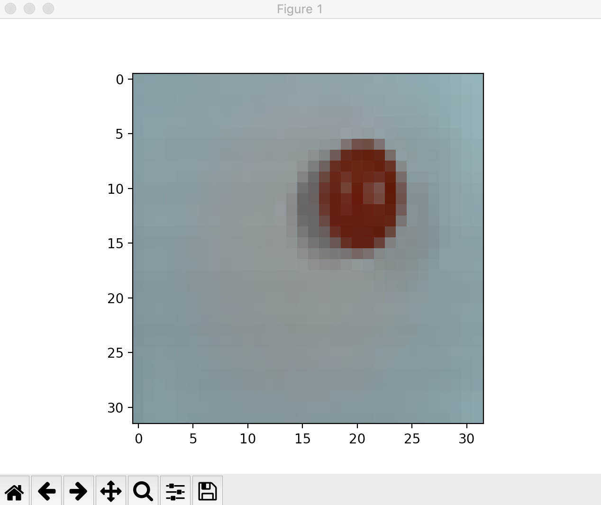
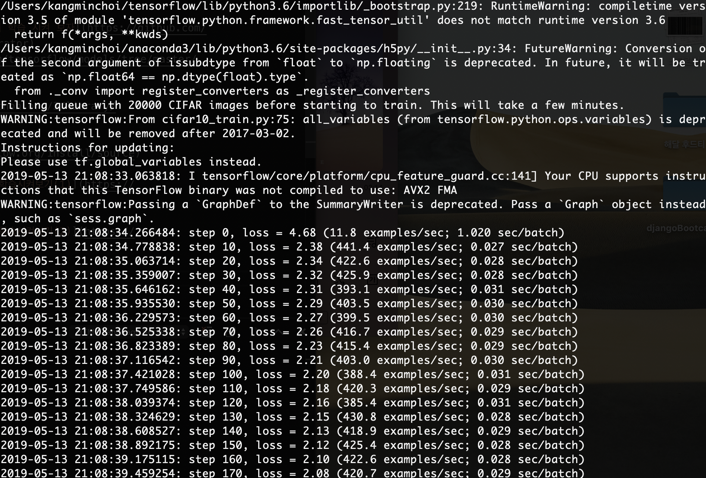
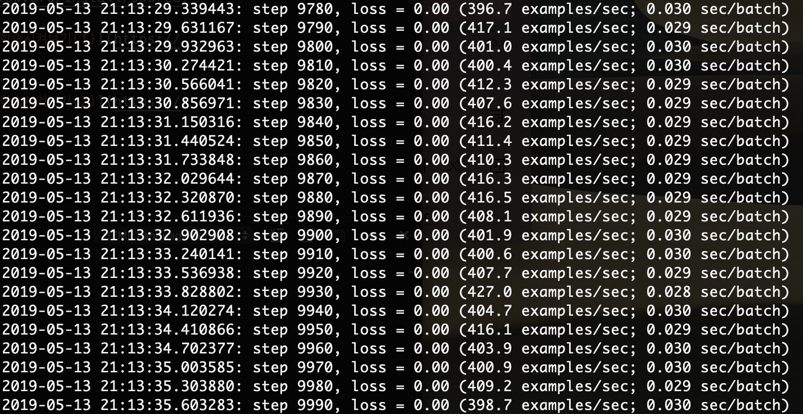

# `Tomato`
> find ripen tomato

Hello, Robotics

## 지영아 사진 찍자

```console
$	while true; do takephoto; sleep 1;done   

$	raspistill -o $(time).jpg  

$	export time="$(date +"%F_%T")"  
```


## `tensorflow` on, off
```console
$ source bin/activate
$ deactivate
```

#### `CIFAR-10`을 활용해 `Tensorflow` 학습하자 - 참고 문서
* [tensorflow 설치](https://www.tensorflow.org/install/source)

* [딥러닝 CIFAR-10 CNN 예제에 내 사진을 넣어서 학습 시켜 보자](https://github.com/hohoins/ml/tree/master/ImageBinaryGenerator)

* [딥러닝 CIFAR-10 CNN 예제에 내 사진을 넣어서 학습 시켜 보자](http://blog.naver.com/PostView.nhn?blogId=cenodim&logNo=220946688251)

* [TensorFlow를 이용하여 나만의 사진으로 CNN 학습시켜보기(1)](https://emaru.tistory.com/25?category=766158)

* [TensorFlow를 이용하여 나만의 사진으로 CNN 학습시켜보기(2)](https://emaru.tistory.com/26)

# `CIFAR-10`와 동일한 `bin` 데이터 생성
[getBinFile.py](getBinfile.py)와 [data 폴더](../data)
```console
$ python getBinFile.py
```
`genBinFile.py`는 data라는 폴더 내부의 폴더들을 모두 bin으로 만들어줌
현재는 `ripen`과 `unripen`만 존재합니다
```
|-data
  |-ripen  
  |-unripen  
```

이제 `genBinFile.py`를 실행하면
```
ripen => label 0
unripen => label 1
```
폴더들을 레이블에 매핑시키고 레이블 별로 이미지들을 적용시켜 bin을 만들어냅니다

# `bin` 데이터 확인
[loadBinFile.py](loadBinFile.py)
```console
$ python loadBinFile.py
```


# 학습시카자

```console
$ python cifar10_train.py
```
## 첫번째 학습




* [모델 평가하기 -> 모델 사용하기](https://tykimos.github.io/2017/08/18/Image_Input_Multiclass_Classification_Model_Recipe/)